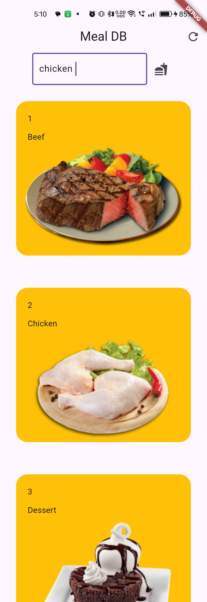
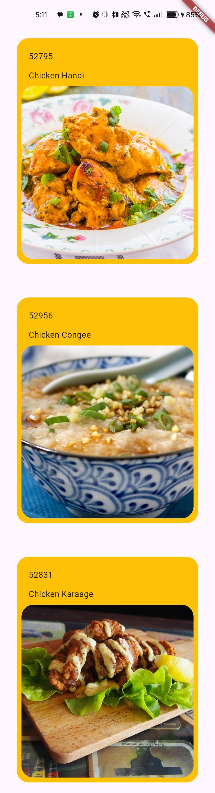
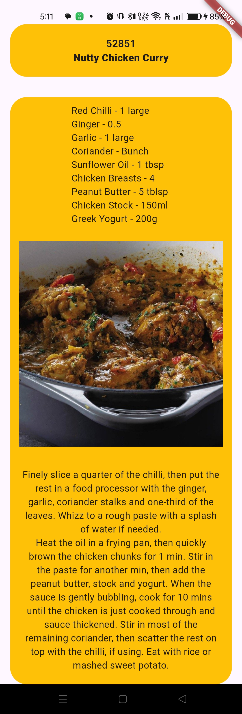

# 🍽️ MealDB Flutter App

A Flutter application that integrates with [TheMealDB API](https://www.themealdb.com) to browse and search meals by category, view meal details, and explore ingredients with their measures.

---

## ✨ Features

- 📂 **Browse Categories**  
  Displays meal categories with thumbnails and descriptions.

- 🔎 **Search Meals**  
  Search meals by name using TheMealDB API.

- 📖 **Detailed Meal View**  
  View meal instructions, ingredients with proper measurements, and thumbnails.

- 🎨 **UI Highlights**  
  - Custom `HomeCard` and `SearchedItemCard` widgets  
  - `Provider` state management  
  - Clean UI with category and search results pages

---

## 🛠️ Tech Stack

- **Flutter** (UI framework)  
- **Provider** (state management)  
- **HTTP package** (API integration)  
- **TheMealDB API** (meal and category data source)

---

## 📸 Screenshots

| Home Page | Search Results | Detailed Meal Page |
|-----------|----------------|--------------------|
|  |  |  |


---

## 🚀 Getting Started

### Prerequisites
- Install [Flutter SDK](https://docs.flutter.dev/get-started/install)  
- Setup an editor like [VS Code](https://code.visualstudio.com/) or Android Studio  

### Installation
```bash
# Clone the repo
git clone https://github.com/your-username/mealdb.git

# Navigate to project folder
cd mealdb

# Install dependencies
flutter pub get

# Run the app
flutter run
